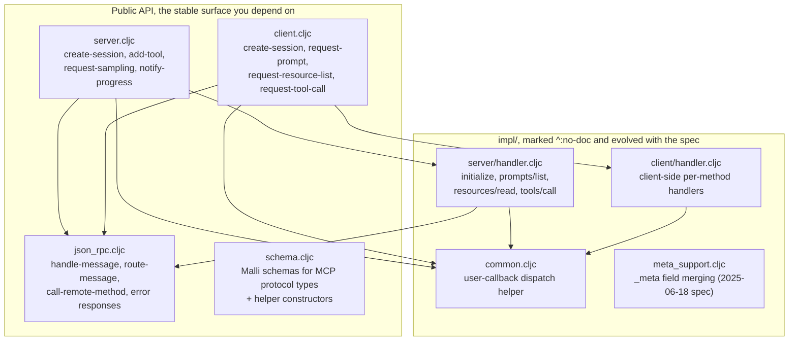
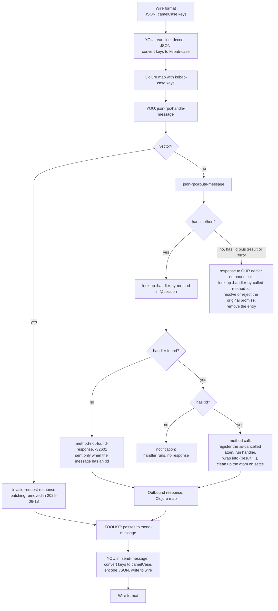

# Architecture

This page is the namespace map, the message lifecycle, and the session/context split. For day-to-day API reference, see [`docs/reference/api-design.md`](../reference/api-design.md), [`docs/reference/session.md`](../reference/session.md), [`docs/reference/context.md`](../reference/context.md), [`docs/reference/using-the-library.md`](../reference/using-the-library.md). This page is the architecture-level orientation.

## Namespace map

Everything lives under `src/mcp_toolkit/`. Arrows point from a namespace to
what it requires.



`schema.cljc` and `meta_support.cljc` sit on their own: neither is required by
another namespace here, so you reach for them directly rather than through the
message path.

| Namespace | Public? | Lines | Role |
|---|---|---|---|
| `mcp-toolkit.server` | yes | ~684 | Server-side public API. `create-session` is the entry point; everything else operates on the `context` (which holds the `session`). |
| `mcp-toolkit.client` | yes | ~347 | Client-side public API. `create-session` (different shape — for clients), then `request-*` / `notify-*` fns to drive the server. |
| `mcp-toolkit.json-rpc` | yes | ~202 | JSON-RPC plumbing. `handle-message` is the single entry point you call when an inbound JSON-RPC message arrives. `call-remote-method` is the outbound side. |
| `mcp-toolkit.schema` | yes | ~791 | Malli schemas + `valid?` / `validate` / `explain` + `!`-suffixed throwing constructors (`enum-schema!`, `url-elicitation!`, `form-elicitation!`, `tool-result-message!`). |
| `mcp-toolkit.impl.*` | **no** (`^:no-doc`) | ~280 total | Per-method handlers. You don't call these directly — they're wired into the session at create-time. |

The split is deliberate: any code under `impl/` is meant to be evolved with the spec, while `server.cljc` / `client.cljc` / `json_rpc.cljc` / `schema.cljc` are the stable surface you depend on.

## The session atom

A session is the mutable state that represents one logical client ↔ server connection. It lives in an atom you own:

```clojure
(def session
  (atom
   (server/create-session
    {:server-info {:name "my-server" :version "1.0.0"}
     :prompts     [...]
     :resources   [...]
     :tools       [...]})))
```

After `(server/create-session opts)` returns, the atom value contains:

| Key | What it holds |
|---|---|
| `:initialized` | `false` until the client sends `notifications/initialized`, then `true` |
| `:protocol-version` | `nil` until handshake; one of `"2024-11-05"` / `"2025-03-26"` / `"2025-06-18"` / `"2025-11-25"` after |
| `:server-supported-protocol-versions` | `["2024-11-05" "2025-03-26" "2025-06-18" "2025-11-25"]` |
| `:server-info` / `:server-instructions` | static metadata you passed in |
| `:client-info` / `:client-capabilities` | populated from the `initialize` request |
| `:prompt-by-name` / `:resource-by-uri` / `:tool-by-name` | indexed registries |
| `:resource-templates` / `:resource-uri-complete-fn` | resource template metadata |
| `:client-subscribed-resource-uris` | `#{}` of URIs the client has subscribed to (`resources/subscribe`) |
| `:client-root-by-uri` | populated after `roots/list` to the client |
| `:logging-level` | `"debug"` by default |
| `:on-initialized` / `:on-client-root-list-changed` / `:on-client-root-list-updated` | user callbacks |
| `:handler-by-method` | the method dispatch table; swapped from `pre-initialization` to `post-initialization` after `notifications/initialized` |
| `:is-cancelled-by-request-id` | `{request-id → atom of bool}` for in-flight cancellable requests |
| `:last-called-method-id` / `:handler-by-called-method-id` | tracking outbound calls awaiting a response |

The session is mutated by the toolkit's handlers (e.g. `prompt-list-handler` reads from it; `add-tool` writes to it and notifies the client). You can also `(swap! session ...)` from your own code — that's the basis of the [REPL workflow](repl-workflow.md).

The client-side session has the symmetric shape: `:server-prompt-by-name` / `:server-resource-by-uri` / `:server-tool-by-name` etc.

## The context hashmap

The context is an immutable Clojure value that the toolkit threads through every handler. It contains:

| Key | What it holds |
|---|---|
| `:session` | the session atom (always present) |
| `:send-message` | `(fn [message] ...)` — sends an outbound JSON-RPC message; **you provide this** |
| `:close-connection` | optional `(fn [])` — called from `json-rpc/close-connection`; useful for graceful shutdown |
| `:message` | the current JSON-RPC message being processed (added by `route-message`) |
| `:is-cancelled` | per-request atom (added when a cancellable method is in flight) |
| `:completion-context` | when a `completion/complete` request includes 2025-06-18-spec context |

You construct the bare context once (with `:session` + `:send-message`); the toolkit decorates it per-message.

The **session-vs-context** rule: anything that mutates per message goes in the session atom; anything you want to pass down to handlers as a one-shot value goes in the context. You can add your own keys to either — handlers receive the context as their one and only argument.

## Message lifecycle

Inbound JSON-RPC messages flow through the toolkit like this:



The toolkit does not know about transports. STDIO, HTTP/SSE, WebSocket — all the same: you decode bytes → Clojure map, hand to `handle-message`, and your `:send-message` fn writes the response back out. See [Kebab-case key transformation](kebab-case-transformation.md) for the JSON ↔ Clojure boundary.

## Initialization handshake

The first two messages are special — they negotiate the protocol version and bootstrap the session:

1. **Client → server: `initialize`** — includes `:protocol-version` (the one the client wants), `:client-info`, `:capabilities`. Server's `initialize-handler` (in `impl/server/handler.cljc`):
   - Picks `protocol-version` = the client's request if supported, else the **last** entry in `:server-supported-protocol-versions` (which is the highest the server knows).
   - Stores `:protocol-version`, `:client-info`, `:client-capabilities` in the session.
   - Returns `{:protocol-version ... :capabilities {...} :server-info {...} :instructions ...?}`.

2. **Client → server: `notifications/initialized`** — the client is ready. Server's `initialized-notification-handler`:
   - Sets `:initialized true`.
   - Swaps `:handler-by-method` from the **pre-initialization** table (`ping` + `initialize` + `notifications/initialized` only) to the **post-initialization** table (the full method set: `prompts/list`, `resources/read`, `tools/call`, etc.).
   - Invokes the `:on-initialized` callback (default: `request-root-list` — fetches the client's filesystem roots).

Before step 2 completes, calling any method other than `initialize` / `ping` returns `Method not found` (-32601). This is enforced by the dispatch table swap, not by ad-hoc checks.

See [Protocol versions](protocol-versions.md) for the version-negotiation algorithm in detail.

## Cancellation

MCP supports `notifications/cancelled` — the client tells the server "stop request id `42`." The toolkit's pattern:

1. When `route-message` dispatches a method call with an `:id`, it creates a per-request atom `(atom false)` and registers it under `:is-cancelled-by-request-id` in the session, keyed by request id. The atom is also added to `context` as `:is-cancelled`.

2. The handler (your `tool-fn`, `prompt-fn`, etc.) can read `(:is-cancelled context)` at any time. If `@is-cancelled` becomes true, the handler should bail out — typically by throwing or returning an error result. The toolkit's `route-message` checks `@is-cancelled` after the handler resolves; if the request was cancelled, the result is **not sent**.

3. When the client sends `notifications/cancelled`, `cancelled-notification-handler` looks up the atom by `request-id` and `(reset! is-cancelled-atom true)`. The in-flight handler sees the change on its next deref.

4. After the handler settles (success or error), `route-message` removes the entry from `:is-cancelled-by-request-id` to avoid leaking memory.

The pattern is in [`example/common-mcp-content/src/example/server_content.cljc`](../../example/common-mcp-content/src/example/server_content.cljc) — the `parentify-tool` checks `@(:is-cancelled context)` between progress steps and throws if cancelled.

## Capability negotiation

The toolkit detects what the client supports via the `:client-capabilities` map populated during `initialize`. The server-side helpers in `mcp-toolkit.server`:

```clojure
(client-supports-elicitation? context)            ; :elicitation key present
(client-supports-form-elicitation? context)       ; :elicitation {} or :elicitation {:form ...}
(client-supports-url-elicitation? context)        ; :elicitation {:url ...}
(client-supports-sampling-tools? context)         ; :sampling {:tools ...}
(client-supports-tasks? context)                  ; :tasks key present
(client-supports-task-augmented-sampling? context); :tasks {:requests {:sampling {:create-message ...}}}
(client-supports-tasks-list? context)             ; :tasks {:list ...}
(client-supports-tasks-cancel? context)           ; :tasks {:cancel ...}
```

The convention: **always** check the capability before calling a feature that requires it. The `request-*` fns in `mcp-toolkit.server` themselves check capabilities and return `nil` (don't send anything) when the client doesn't declare support. See [2025-11-25 features](2025-11-25-features.md) for the full feature-by-feature breakdown.

## REPL-time mutations

Several `mcp-toolkit.server` fns are designed to be called from a REPL while the server is running. They mutate the session and notify the client of the change:

| Fn | Effect |
|---|---|
| `add-prompt` / `remove-prompt` | mutate `:prompt-by-name`, send `prompts/list_changed` notification |
| `add-resource` / `remove-resource` | mutate `:resource-by-uri`, send `resources/list_changed` |
| `add-tool` / `remove-tool` | mutate `:tool-by-name`, send `tools/list_changed` |
| `set-resource-templates` | mutate `:resource-templates` |
| `set-resource-uri-complete-fn` | mutate `:resource-uri-complete-fn` |
| `notify-resource-updated` | send `resources/updated` for a specific URI (only fires if the client is subscribed) |
| `notify-progress` | send `progress` if the current message had a `:progress-token` |
| `notify-log` | send `message` log notification if the level meets the session's threshold |

This is the basis of [the REPL workflow](repl-workflow.md): you can add a tool, edit it, remove it, re-add it, all while Claude Desktop or the MCP Inspector is connected and seeing the changes live.

## See also

- [`docs/reference/api-design.md`](../reference/api-design.md), [`docs/reference/session.md`](../reference/session.md), [`docs/reference/context.md`](../reference/context.md) — the upstream Metosin reference docs.
- [Kebab-case key transformation](kebab-case-transformation.md) — the JSON ↔ Clojure boundary that this page treats as a black box.
- [Protocol versions](protocol-versions.md) — the version-negotiation algorithm.
- [REPL workflow](repl-workflow.md) — using the REPL-mutation fns above in practice.
